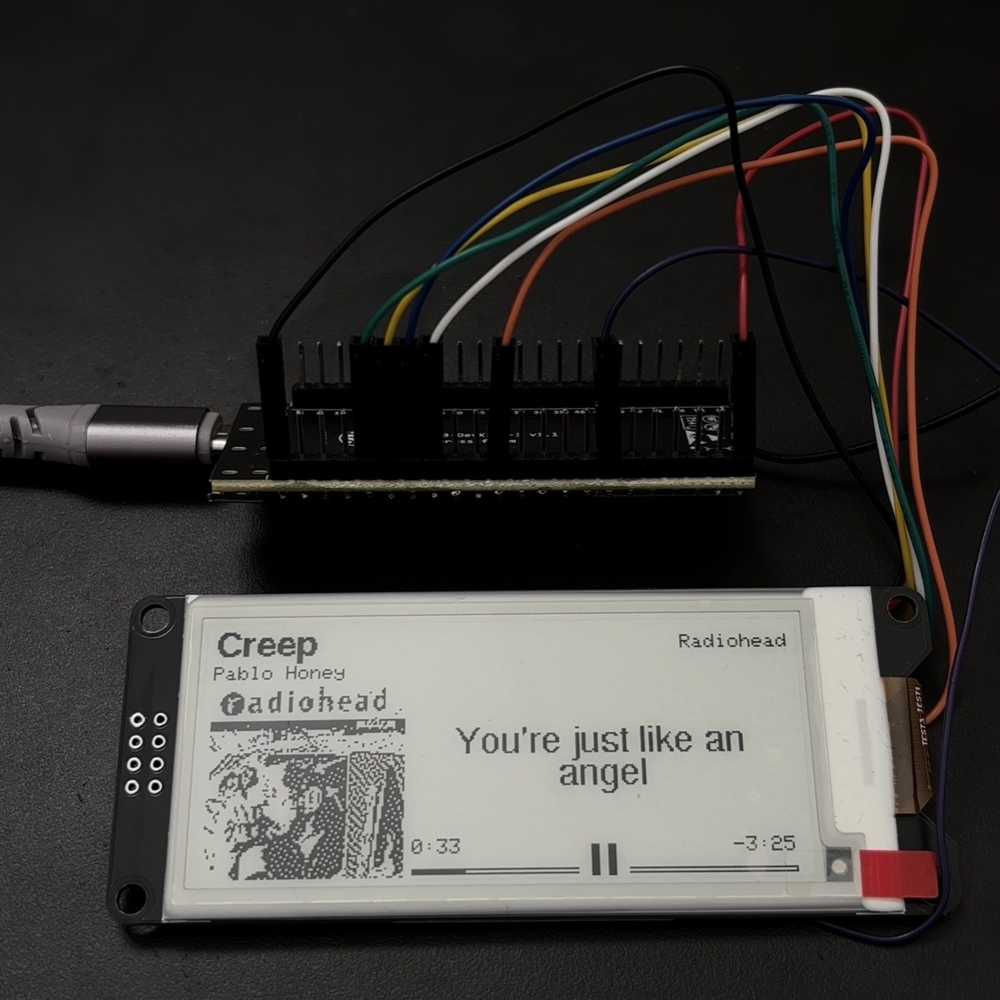
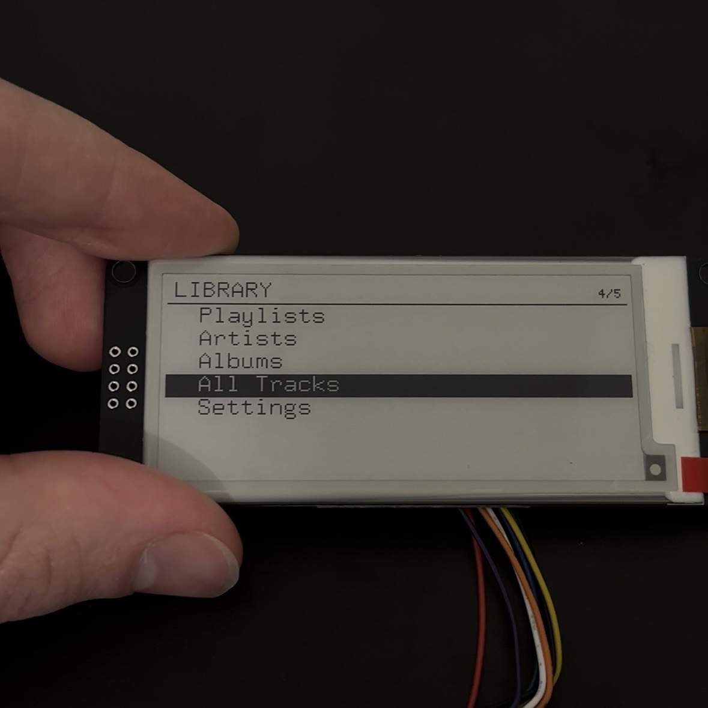

# MusicStation

*A RomansLab project: building a focused, physical way to experience music.*



MusicStation is an ESP32-S3 music interface built around a 2.9-inch e-paper
display. The current V1 is a working iPhone companion: it reads now-playing
metadata through Bluetooth, fetches album artwork and synchronized lyrics over
Wi-Fi, and renders a compact monochrome player screen.

The long-term goal is a self-contained, offline music station with music stored
on microSD, physical controls, local audio playback, speakers, and a MAX98357A
I2S amplifier. V1 proves the display, interaction, metadata, artwork, lyrics,
Bluetooth, and memory-management parts before the audio hardware is added.

> **Current status:** functional display prototype. It does not yet contain
> microSD storage, an amplifier, speakers, or physical buttons, and it currently
> relies on an iPhone for playback state plus Wi-Fi for artwork and lyrics.

## V2: offline player



The next version moves the music library onto a microSD card and adds local
artwork, synchronized lyrics, playlists, five physical buttons, and a path to
I2S audio through a MAX98357A amplifier. The firmware, storage layout, wiring
notes, UI design, and preparation tools are in [V2](V2/README.md).

> **V2 status:** M0-M6 are written, but the new sketch has not yet been run on
> the wired hardware. Audio uses a simulated playhead until the amplifier is
> fitted.

## What V1 does today

- Pairs from normal iOS Bluetooth settings as a BLE HID accessory.
- Reads artist, album, title, duration, elapsed time, and playback state through
  Apple Media Service (AMS).
- Displays album artwork as a sharpened, dithered 96x96 monochrome image.
- Fetches synchronized lyrics from LRCLIB and follows the current lyric.
- Supports UTF-8 metadata and lyrics written with the Cyrillic alphabet.
- Shows elapsed/remaining time, progress, and a play/pause action icon.
- Updates only the affected e-paper region and suppresses repeated refreshes
  while paused or disconnected.
- Keeps BLE callbacks allocation-free and protects track assets against stale
  asynchronous metadata.

The HID report already describes play/pause, next, and previous actions, but no
buttons are wired in V1.

## Project direction

| Stage | Purpose | Status |
|---|---|---|
| V1 | ESP32-S3 + e-paper iPhone now-playing display | Working prototype |
| V1.x | Physical play/pause, next, and previous buttons | Planned |
| V2 | microSD music library and local track navigation | Planned |
| V2 | ESP32 I2S audio output through MAX98357A | Planned |
| V2 | Integrated speakers, power design, and enclosure | Planned |
| Later | Fully offline artwork, metadata, and synchronized lyrics | Direction |

The intended destination is an appliance that can play music without a phone,
hotspot, or cloud service. The current online integrations are useful prototype
infrastructure, not the final dependency model.

## Current hardware

- ESP32-S3 board/module using ESP32-S3-WROOM-1U
- External 2.4 GHz antenna for the `-1U` module
- WeAct Studio 2.9-inch black/white e-paper module
- DEPG0290BS 296x128 panel with SSD1680 controller

### E-paper wiring

| WeAct pin | ESP32-S3 pin | Function |
|---|---:|---|
| VCC | 3V3 | Power |
| GND | GND | Ground |
| SDA | GPIO11 | SPI MOSI, not I2C SDA |
| SCL | GPIO12 | SPI clock, not I2C SCL |
| CS | GPIO10 | Chip select |
| D/C | GPIO9 | Data/command |
| RES | GPIO8 | Reset |
| BUSY | GPIO7 | Display busy output |

MISO is not used. Power the display from 3.3 V. See [WIRING.md](WIRING.md)
for more detailed hardware notes.

## Software dependencies

The latest verified build uses:

- Arduino ESP32 core 3.2.1
- GxEPD2 1.6.9
- Adafruit GFX 1.12.6
- ArduinoJson 7.4.2
- JPEGDEC 1.8.4
- U8g2_for_Adafruit_GFX 1.8.0

Select an ESP32-S3 board profile with:

- USB CDC enabled on boot if you want serial diagnostics
- Huge APP partition scheme
- PSRAM disabled for the currently tested board

## Build and configure

1. Install the dependencies listed above through the Arduino Library Manager.
2. Copy `config.example.h` to `config.h`.
3. Put the credentials for a reachable 2.4 GHz Wi-Fi network in `config.h`.
   The file is ignored by Git and must stay local.
4. Open `MusicStation.ino` in Arduino IDE.
5. Select the ESP32-S3 board and build settings described above.
6. Compile and upload.

For the current iPhone-hotspot setup, enabling **Maximize Compatibility** can
help expose the hotspot on 2.4 GHz.

## Pairing and use

1. Power MusicStation and wait for its pairing screen.
2. Open **Settings > Bluetooth** on the iPhone or iPad.
3. Select `MusicStation` and enter the passkey shown on the e-paper display.
4. Enable the configured Wi-Fi network or Personal Hotspot.
5. Start music playback on the iPhone.

If bonding becomes corrupted, forget MusicStation on the iPhone, erase the
ESP32 bond/flash state, and pair again.

## How V1 works

```text
iPhone playback
      |
      | BLE HID + Apple Media Service
      v
   ESP32-S3  <---- Wi-Fi/HTTPS ---- iTunes artwork + LRCLIB lyrics
      |
      | SPI
      v
296x128 SSD1680 e-paper
```

The firmware streams JSON responses instead of retaining entire documents,
stores lyric text in a pooled arena, rejects stale track requests, and uses a
rolling three-row image-sharpening buffer. These choices preserve contiguous
internal heap for TLS and JPEG decoding while BLE and Wi-Fi are active.

E-paper refreshes are region-based:

- Full screen for startup and periodic cleanup
- Whole logical screen for new metadata/artwork
- Right column for lyric changes
- Bottom-right strip for time, progress, and play/pause state

## Current limitations

- Playback audio still comes from the paired iPhone.
- Artwork and lyrics currently require internet access.
- Physical media buttons are not wired yet.
- Lyrics depend on LRCLIB having synchronized data for the recording.
- The current HTTPS prototype uses `setInsecure()` and does not validate server
  certificates.
- Cyrillic and printable ASCII are supported; other writing systems may need
  additional embedded fonts and text-layout work.
- Frequent progress updates remain the main source of e-paper refresh cycles.

## Repository safety

`config.h` is intentionally ignored. Only `config.example.h` belongs in the
repository. Before publishing a fork, scan the complete staged content and Git
history for credentials, private media, generated files, and device-specific
data.

## License

MusicStation is open-source software released under the [MIT License](LICENSE).
You may use, modify, and redistribute it, including in commercial projects,
provided the copyright and license notice are retained.
